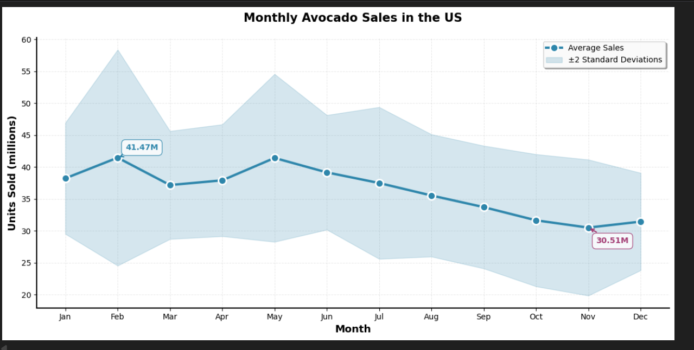
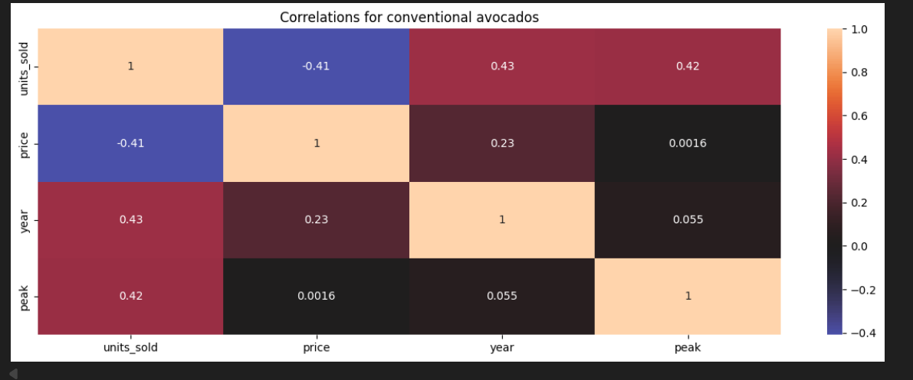
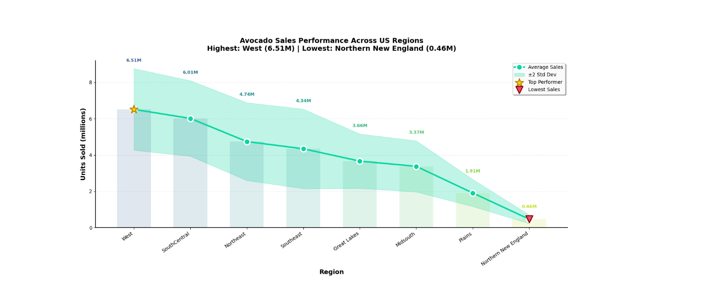

# Price Optimization for Revenue Maximization

## 📊 What is Price Optimization?

Price optimization is a data-driven strategy that uses mathematical modeling and statistical analysis to determine the optimal pricing strategy that maximizes revenue or profit. Unlike traditional pricing methods based on gut feeling or simple cost-plus approaches, price optimization considers:

- **Demand elasticity**: How customer demand responds to price changes
- **Market dynamics**: Seasonal patterns, regional variations, and competitive factors
- **Operational constraints**: Supply limitations, transportation costs, and waste management
- **Customer behavior**: Historical purchasing patterns and price sensitivity

By leveraging optimization algorithms, businesses can find the sweet spot where pricing balances demand generation with profitability, while accounting for real-world operational constraints.

---

## 🎯 Project Overview

This project implements an end-to-end price optimization framework that combines **demand forecasting** with **mathematical optimization** to maximize revenue across multiple regions. The solution accounts for transportation costs, waste management, and supply constraints to provide actionable pricing recommendations.

### Key Features
- Regional demand analysis and forecasting
- Seasonality and correlation analysis
- Multi-region optimization with supply constraints
- Transportation cost modeling
- Waste minimization strategies

---

## 🔍 Project Methodology

### **Part 1: Exploratory Data Analysis**

The first phase involves comprehensive data exploration to understand market dynamics:

#### **Seasonality Analysis**
- Identified temporal patterns in sales data
- Detected peak and off-peak periods
- Analyzed year-over-year trends


#### **Correlation Analysis**
- Examined relationships between price and demand
- Investigated feature correlations
- Identified key drivers of sales performance


#### **Regional Analysis**
- Compared sales performance across different regions
- Identified regional pricing opportunities
- Analyzed geographic demand variations

---

### **Part 2: Demand Forecasting**

Built a predictive model to estimate demand as a function of price and other factors:

#### **Demand Function**

```
demand = β₀ + β₁(price) + β₂(year_index) + β₃(region) + β₄(peak) + ϵ
```

Where:
- **β₀**: Baseline demand (intercept)
- **β₁**: Price elasticity coefficient (demand sensitivity to price)
- **β₂**: Temporal trend coefficient (demand growth over time)
- **β₃**: Regional effect coefficient (location-specific demand)
- **β₄**: Seasonality coefficient (peak vs. off-peak impact)
- **ϵ**: Error term

#### **Modeling Approach**
- **Method**: Ordinary Least Squares (OLS) Regression
- **Purpose**: Predict region-specific demand at various price points
- **Output**: Demand forecasts d(pᵣ, r) for each region r at price pᵣ

This model captures the fundamental trade-off: higher prices reduce demand but increase per-unit revenue.

---

### **Part 3: Optimization Model**

Formulated and solved a mathematical optimization problem to determine optimal prices and allocation strategies.

#### **Objective Function**

Maximize total revenue across all regions:

```
maximize: Σᵣ (pᵣ × sᵣ - c_waste × wᵣ - cᵣ_transport × xᵣ)
```

Where:
- **pᵣ**: Price in region r
- **sᵣ**: Sales quantity in region r
- **c_waste**: Cost per unit of wasted inventory
- **wᵣ**: Waste quantity in region r
- **cᵣ_transport**: Transportation cost to region r
- **xᵣ**: Quantity allocated to region r

#### **Constraints**

**1. Supply Constraint**
```
Σᵣ xᵣ = B
```
Total allocation across all regions equals available budget/supply B.

**2. Sales Feasibility**
```
sᵣ ≤ xᵣ
sᵣ ≤ d(pᵣ, r)
```
Sales cannot exceed allocated inventory or predicted demand.

**3. Waste Definition**
```
wᵣ = xᵣ - sᵣ
```
Waste equals the difference between allocation and actual sales.

#### **Solution Method**
- **Solver**: Gurobi Optimizer
- **Problem Type**: Mixed-Integer Linear Programming (MILP)
- **Output**: Optimal prices and allocation quantities for each region

---

## 💡 Key Insights

This optimization framework enables:

1. **Data-Driven Pricing**: Prices based on demand forecasts rather than intuition
2. **Resource Efficiency**: Optimal allocation minimizes waste and transportation costs
3. **Regional Customization**: Different prices for different markets based on local demand
4. **Profit Maximization**: Balances revenue generation with operational costs
5. **Scalability**: Framework can be extended to more regions and constraints

---

## 🛠️ Technologies Used

- **Python**: Core programming language
- **Pandas/NumPy**: Data manipulation and analysis
- **Statsmodels**: OLS regression for demand forecasting
- **Gurobi**: Mathematical optimization solver
- **Matplotlib/Seaborn**: Data visualization
- **Jupyter Notebook**: Interactive development environment

---

## 📈 Business Impact

This price optimization solution provides:

- **Revenue Enhancement**: Identifies optimal prices that maximize total revenue
- **Cost Reduction**: Minimizes waste and transportation expenses
- **Strategic Planning**: Informs inventory allocation decisions
- **Competitive Advantage**: Data-driven approach to market pricing
- **Operational Efficiency**: Better resource utilization across regions

---

## 🚀 Future Enhancements

- Incorporate competitor pricing data
- Add dynamic pricing for real-time adjustments
- Include promotional impact in demand model
- Extend to multi-product optimization
- Implement machine learning models for improved forecasting
- Add capacity constraints and production costs

---

## 📝 Conclusion

This project demonstrates how combining statistical modeling with mathematical optimization can transform pricing decisions from art to science. By integrating demand forecasting with constrained optimization, businesses can make data-driven pricing decisions that maximize profitability while respecting operational realities.

---

## 📧 Contact

For questions or collaboration opportunities, please reach out through the repository issues or contact section.

---

*Built with data-driven decision making in mind* 🎯
